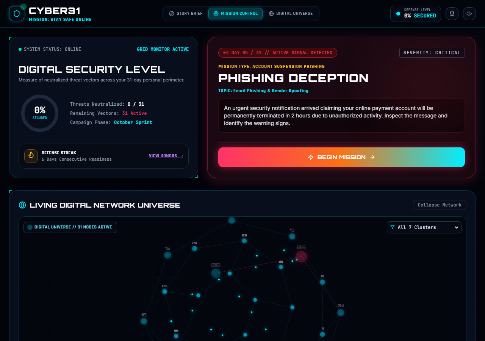

<div align="center">

# 🛡️ CYBER31

### 31 Days. 31 Missions. One Safer Digital Life.

A gamified cybersecurity awareness campaign that turns real-world online threats — phishing emails, smishing texts, fake QR codes, rogue Wi-Fi, deepfake calls, and more — into interactive, tap-to-investigate missions.

[](https://cyber31.vercel.app)
[](https://react.dev)
[](https://vitejs.dev)
[](https://tailwindcss.com)
[](https://supabase.com)

**[▶ View Live Site](https://cyber31.vercel.app)**

</div>

<br>

<div align="center">
  
</div>

<br>

## Table of Contents

- [About](#about)
- [Features](#features)
- [Mission Categories](#mission-categories)
- [Tech Stack](#tech-stack)
- [Getting Started](#getting-started)
- [Progress Persistence](#progress-persistence)
- [Reviewer / Demo Controls](#reviewer--demo-controls)
- [Project Structure](#project-structure)
- [Deployment](#deployment)
- [Contributing](#contributing)

## About

CYBER31 is a 31-day cybersecurity awareness challenge presented as an interactive "mission control" experience. Each day unlocks a new scenario — a suspicious email, an unfamiliar QR code, a too-good-to-be-true investment DM — and the player has to spot the red flags themselves rather than just read a static tip.

It was built for **THM Cyber Week**, but works as a standalone awareness tool for students, teams, or anyone who wants a hands-on refresher on staying safe online.

## Features

| | |
|---|---|
| 🎯 **31 distinct missions** | Password hygiene, phishing, smishing, deepfakes, QR scams, rogue Wi-Fi, ransomware, SIM swapping, and more — each with its own interaction style |
| 🕹️ **Tap-to-investigate gameplay** | Spot the red flags yourself inside a simulated email/SMS/website/app rather than reading a wall of text |
| 🌐 **3D "Digital Universe" view** | All 31 missions rendered as an explorable, draggable node graph on an HTML canvas |
| 🏆 **Achievements & streaks** | Milestone badges unlock as missions are completed, with a defense-streak counter |
| 📱 **Fully responsive** | Works down to small mobile viewports, with a dedicated bottom nav bar |
| ☁️ **Optional cloud sync** | Progress persists to `localStorage` by default, with opt-in cross-device sync via Supabase |
| ♿ **Keyboard accessible** | Mission cards and interactive choices are reachable and operable without a mouse |

## Mission Categories

The 31 missions are grouped into 7 threat categories:

| Category | Focus |
|---|---|
| 🔐 Digital Identity | Passwords, passphrases, 2FA, password managers, credential stuffing |
| 📧 Communication | Phishing, smishing, social engineering DMs, deepfake calls |
| 🌐 Browsing Safety | Typosquatting, HTTPS, malicious extensions, malvertising |
| 📱 Digital Life | Oversharing, spam traps, app permissions, software updates |
| 💳 Transactions | Overpayment scams, investment/pig-butchering scams, OTP theft |
| 🦠 Digital Threats | Malware attachments, BadUSB, ransomware, scareware, IoT defaults |
| ☁️ Data & Privacy | Public Wi-Fi, cloud sharing, data brokers, QR codes, SIM swapping |

## Tech Stack

- **[React 18](https://react.dev)** + **[Vite 6](https://vitejs.dev)** — UI and build tooling
- **[Tailwind CSS](https://tailwindcss.com)** — utility-first styling with a custom cyber theme
- **[lucide-react](https://lucide.dev)** — icon set
- **[canvas-confetti](https://github.com/catdad/canvas-confetti)** — milestone celebration effects
- **HTML Canvas** — hand-rolled 3D projection for the Digital Universe view (no 3D library dependency)
- **[@supabase/supabase-js](https://supabase.com/docs/reference/javascript)** — optional cross-device progress sync

## Getting Started

```bash
npm install
npm run dev
```

Open the printed local URL (typically `http://localhost:5173`).

```bash
npm run build    # production build to dist/
npm run preview  # preview the production build locally
```

## Progress Persistence

Mission completion, streaks, and achievements are saved to `localStorage` by default — no setup required.

### Optional: cross-device cloud sync

The app can optionally sync progress to a [Supabase](https://supabase.com) project so progress follows a visitor across devices/browsers:

1. Create a free Supabase project.
2. Run [`supabase/schema.sql`](supabase/schema.sql) in the project's SQL editor.
3. Copy `.env.example` to `.env.local` and fill in `VITE_SUPABASE_URL` and `VITE_SUPABASE_ANON_KEY` from **Project Settings → API Keys → "Publishable and secret API keys"** tab — use the **Publishable key** (`sb_publishable_...`). Do not use the Secret key or the legacy `service_role`/`anon` JWT keys.
4. Restart the dev server.

Without those env vars set, the app runs exactly as before, on `localStorage` alone — cloud sync is fully optional and fails silently if unreachable.

## Reviewer / Demo Controls

A "Command Controls" panel (jump to any mission, unlock all, reset progress) is available:

- Automatically in local development (`npm run dev`)
- On a deployed build, by appending `?review=1` to the URL

It is hidden from ordinary visitors otherwise, so a live link can't be used to instantly cheat the game.

## Project Structure

```
src/
├── components/
│   ├── missions/        # One component per mission interaction type
│   │                     # (phishing, smishing, scenario, deepfake, wifi, ...)
│   ├── Dashboard.jsx     # Mission grid, filters, security level summary
│   ├── DigitalUniverse.jsx  # Canvas-based 3D node graph of all 31 missions
│   ├── MissionModal.jsx  # Mission runner: routes to the right mission component
│   ├── CyberHeader.jsx   # Nav, security badge, achievements, audio toggle
│   └── ...
├── data/
│   ├── missionsData.js   # All 31 mission definitions (briefing, scenario, takeaway)
│   ├── achievementsData.js
│   └── categories.js
├── utils/
│   ├── storage.js        # localStorage persistence + Supabase sync orchestration
│   ├── supabaseClient.js # Optional Supabase client (no-op if unconfigured)
│   └── audio.js          # Web Audio SFX
└── App.jsx

supabase/
└── schema.sql            # Optional cloud-sync table + RLS policies
```

## Deployment

This is a static Vite build — deploy `dist/` to any static host.

**Vercel**
```bash
npm i -g vercel
vercel
```
(Framework preset: Vite. No extra config needed.)

**Netlify**
```bash
npm run build
# Drag-and-drop the dist/ folder at app.netlify.com/drop,
# or connect the repo with build command `npm run build` and publish dir `dist`.
```

If using Supabase cloud sync, set `VITE_SUPABASE_URL` and `VITE_SUPABASE_ANON_KEY` as environment variables in your host's project settings (not just `.env.local`, which isn't deployed).

## Contributing

Issues and pull requests are welcome. If you're adding a new mission, follow the existing shape in [`missionsData.js`](src/data/missionsData.js) — each entry needs a `day`, `category`, `title`, `briefing`, `missionType`, and `takeaway` at minimum, plus either a `scenario` (for the generic multiple-choice format) or a matching component in `src/components/missions/`.

---

<div align="center">
<sub>Built for THM Cyber Week — 31 Days. 31 Missions. One Safer Digital Life.</sub>
</div>
